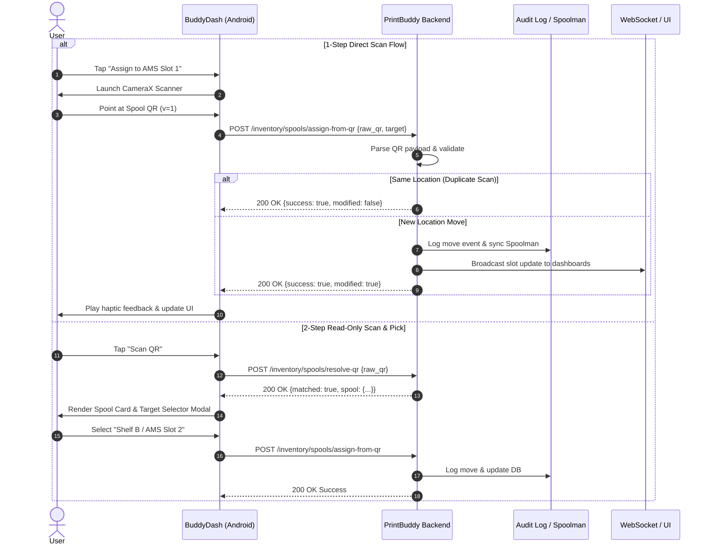

# Master Implementation Plan & UX Guide: Backend-First Spool QR API, Mobile Label Printing & Upstream PR #1606 Strategy

---

## Executive Overview

This document defines the complete backend-first architecture for extending **PrintBuddy (Server)** and **BuddyDash (Android App)** with spool QR management, mobile camera scanning, and direct Phomemo Bluetooth thermal label printing.

### Core Architectural Principle
> **The PrintBuddy FastAPI backend is the sole source of truth for QR resolution, payload parsing, target validation, idempotency, and single-location move semantics. BuddyDash Android app remains a thin client for camera capture, mobile UX, and Bluetooth thermal printing.**

This architecture prevents merge conflicts with upstream **bambuddy** PR `#1606` (`feat(inventory): scan-to-location QR assignment`) while ensuring web, mobile, and future NFC systems execute identical, audited inventory rules.

---

## Part 1: Upstream PR #1606 Analysis & Merge Strategy

### 1. What Upstream PR #1606 Does
Upstream PR `maziggy/bambuddy#1606` introduces:
- A browser-based web camera QR scanner in `InventoryPage.tsx` and `SpoolBuddyInventoryPage.tsx`.
- Frontend QR target assignment modals (`QrAssignTargetModal.tsx`) and client-side QR string utilities (`qrAssignTarget.ts`).

### 2. Upstream Conflict-Avoidance Strategy
To eliminate git merge conflicts when upstream merges PR `#1606`:
1. **Isolated Local Testing Branch**: We test PR `#1606` in a dedicated local branch (`test/upstream-pr-1606`):
   ```bash
   git fetch origin pull/1606/head:test/upstream-pr-1606
   git checkout test/upstream-pr-1606
   ```
2. **Backend-First Isolation**: We do not modify the frontend pages touched by PR `#1606`. Instead, all custom QR logic resides in dedicated backend modules (`backend/app/api/routes/inventory_qr.py` and `backend/app/services/qr_resolver.py`).
3. **Upstream API Alignment**: If upstream later introduces server-side QR APIs, our endpoints serve as canonical handlers or lightweight aliases without breaking the mobile app.

---

## Part 2: Backend API Specifications & Error Contracts

### 1. Flexible Payload Resolution Engine (`qr_resolver.py`)
Parses and normalizes any of the following QR payload formats:
- **Canonical Versioned Format**: `bambuddy://spool?v=1&id=42` (with optional `&sig=<token>` hook)
- **Web URLs**: `http(s)://<host>/inventory?spool=42`, `http(s)://<host>/spools/42`
- **Key-Value Strings**: `spool=42`, `id=42`
- **Raw Integers**: `42`

---

### 2. Read-Only Resolution Endpoint: `POST /api/v1/inventory/spools/resolve-qr`

100% read-only and side-effect free.

**Request Body**:
```json
{
  "raw_qr": "bambuddy://spool?v=1&id=42"
}
```

**Success Response (`200 OK`)**:
```json
{
  "spool_id": 42,
  "matched": true,
  "spool": {
    "id": 42,
    "brand": "Sunlu",
    "material": "PLA",
    "color_name": "Galaxy Black",
    "color_hex": "#1A1A1A",
    "remaining_weight_g": 520,
    "current_location": "Shelf A"
  },
  "parsed_meta": {
    "version": 1,
    "scheme": "bambuddy",
    "signature_present": false
  }
}
```

**Error Contracts**:
- `400 Bad Request` (`INVALID_QR_FORMAT`): Payload cannot be parsed.
- `404 Not Found` (`SPOOL_NOT_FOUND`): Spool ID does not exist.
- `422 Unprocessable Entity` (`SPOOL_ARCHIVED`): Spool is archived/deleted.

---

### 3. Atomic Assignment Endpoint: `POST /api/v1/inventory/spools/assign-from-qr`

Sole mutation endpoint for single-location moves.

**Request Body**:
```json
{
  "raw_qr": "bambuddy://spool?v=1&id=42",
  "target": {
    "kind": "ams",
    "printer_id": 1,
    "ams_id": 0,
    "tray_id": 1
  },
  "client_source": "BuddyDash_Android"
}
```

**Success Response (`200 OK`)**:
```json
{
  "success": true,
  "modified": true,
  "spool_id": 42,
  "previous_location": "Storage: Shelf A",
  "new_location": "Printer 1 - AMS 0 - Tray 1",
  "audit_event_id": 892
}
```

**Idempotent Double-Scan (`200 OK`)**:
*(Returned when spool is scanned into the exact location it already occupies)*
```json
{
  "success": true,
  "modified": false,
  "message": "Spool is already assigned to this location.",
  "spool_id": 42,
  "new_location": "Printer 1 - AMS 0 - Tray 1"
}
```

**Error Contracts**:
- `400 Bad Request` (`INVALID_TARGET`): Invalid printer/AMS slot.
- `404 Not Found` (`SPOOL_NOT_FOUND`): Spool ID missing.
- `409 Conflict` (`TARGET_OCCUPIED_LOCKED`): Target slot is locked by an active print job.
- `403 Forbidden` (`INSUFFICIENT_PERMISSIONS`): API key lacks write access.

---

## Part 3: Audit Trail & Inventory Event Logging

Every location move executed via `assign-from-qr` appends a record to `inventory_audit_logs`:

```json
{
  "timestamp": "2026-07-25T00:30:00Z",
  "spool_id": 42,
  "previous_location": "Storage: Shelf A",
  "new_location": "Printer 1 - AMS 0 - Tray 1",
  "client_source": "BuddyDash_Android",
  "triggered_by": "api_key_root",
  "method": "qr_scan"
}
```

This guarantees full auditability and synchronizes with **Spoolman** and **WebSockets** automatically.

---

## Part 4: BuddyDash Android Integration

### Scanner Workflows
- **1-Step Direct Scan Flow**: Tap empty slot -> Open CameraX -> Scan QR -> Direct `POST /assign-from-qr` call.
- **2-Step Read-Only Flow**: Tap Scan QR -> Open CameraX -> Call `POST /resolve-qr` -> Preview Spool Detail Card -> Tap target slot modal.

### Phomemo Bluetooth Thermal Printing
- **Format**: 30mm circular label (240x240 px at 203 DPI).
- **Transport**: Bluetooth RFCOMM socket (`PhomemoBluetoothPrinter.kt`).
- **Raster Encoding**: 1-bit monochrome ESC/POS & TSPL binary commands.

---

## Part 5: Non-Goals for Phase 1

1. Multi-tenant cryptographic QR signature enforcement.
2. Offline-first local mobile database syncing.
3. Hardware RFID/NFC tag write bridge.

---

## Part 6: Sequence Diagram & Verification Checklist



### Manual Verification Checklist
- [ ] Scan physical 30mm Phomemo printed label with phone camera & BuddyDash CameraX.
- [ ] Test 1-step assignment to AMS Slot 1; verify UI updates instantly via WebSocket.
- [ ] Test re-assigning spool to storage location; verify previous AMS slot is cleared.
- [ ] Verify duplicate scan returns `modified: false`.
- [ ] Checkout branch `test/upstream-pr-1606` and verify no rebase or file conflicts.
